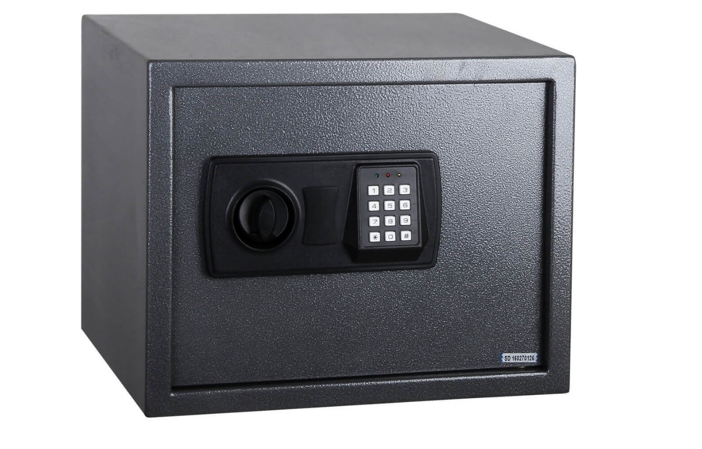

# Cofre 21a - Avaliação Prática 1

> Adaptado de AV1 21a

## Descrição

Nessa avaliação iremos trabalhar com o OLED1 e iremos desenvolver um protótipo de um **cofre digital**.

> Figura meramente ilustrativa =) [src](https://www.celeti.com.br/cofre-unee-classic-keypad-ucdck)

## Necessário

O protótipo deve possuir o seguinte comportamento:

- A senha é definida por uma sequência dos botões 1, 2 e 3 da placa OLED (B1, B2 e B3).
- O cofre deve possuir uma senha fixa de tamanho 4 definido previamente por: `[B1 B1 B2 B3]`.
- Para cada vez que um botão for apertado deve exibir um `*` no display.
- Se a senha estiver correta, abre o cofre.
- Senha errada:
  - Bloqueia os botões por 4 segundos (deve-se usar **RTT**).
  - Exibe no LCD: `Senha errada` / `Bloqueado`.
- Cofre fechado:
  - Exibe no LCD: `Cofre Trancado`.
  - Todos os LEDs acesos.
- Cofre aberto:
  - Exibe no LCD: `Cofre Aberto`.
  - Todos os LEDs apagados.
- Para trancar o cofre é necessário apertar o botão 1.

Requisitos de firmware:

- Botões funcionando com interrupção.
- Usa RTT para timeout de 4s.
- Uso do RTOS

Assista ao vídeo no youtube com a implementação anterior:

### Itens extras

> Só pára você praticar.. na prova vai ser apenas até o necessário.

- Possibilita usuário definir a senha (quando ligar a placa)
- Se errar a senha pela segunda vez seguida bloqueia por 10 segundos
- Uma vez o cofre aberto, para fechar é necessário apertar (e segurar) o botão 1 por alguns segundos
- Senha padrão com 6 digitos (`[B1 B1 B2 B2 B3 B1]`).
- Pisca os Leds enquanto a senha estiver bloqueada (**Usar TC**).
- A senha possui um timeout de 4 segundos, intervalo máximo entre o usuário apertar o próximo botão, estourado o tempo a senha é zerada e começa tudo novamente.
- Adiciona uma mensagem indicando quando que o cofre foi aberto: `dd:mm:aa / hh:mm` (**Usar RTC**)
